# 1. MyBatis入门

## 1.1.1 MyBatis 简介

> 1. 支持定制化SQL，存储过程以及高级映射的优秀的轻量级的持久层框架
> 
> 2. 避免了几乎所有的JDBC代码和手动设置参数及获取结果集
>
> 3. 可以使用简单的XML或注解用于配置和原始映射，将接口和Java的POJO(Plain Old Java Objects,普通的Java对象)映射成数据库中的记录
>
> 4. 是半自动的ORM(Object Relation Mapping)框架；旨在消除sql和hql

   <hr style="margin:50px 0px;background-color:pink;"/>

## 1.2.1  编写查询程序

### 1.2.1-0 创建数据库

> ```sql
> CREATE TABLE tbl_employees(
> 	id INT(11) PRIMARY KEY AUTO_INCREMENT,
> 	last_name VARCHAR(255),
> 	gender CHAR(1),
> 	email VARCHAR(255)
> )
> ```
>
> **数据库数据自行添加**

### 1.1.2-1 创建项目

#### 	图片1.2.1-1.0.1  

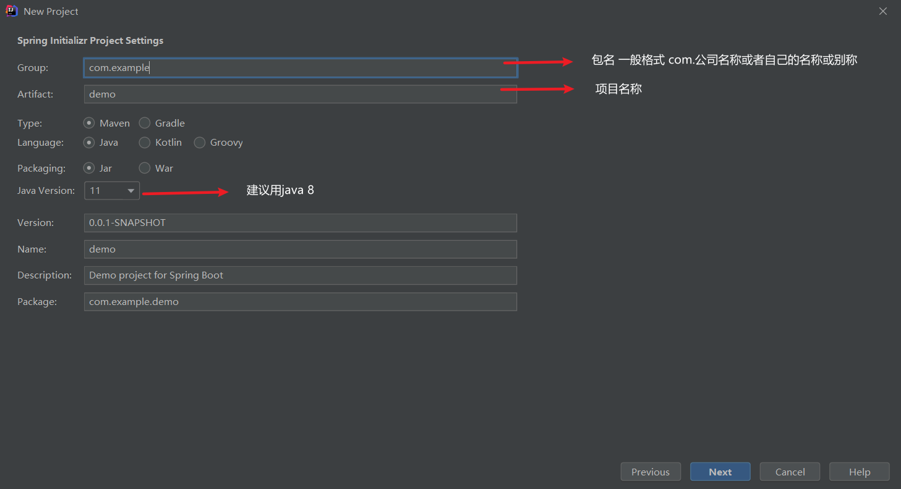


#### 	图片1.2.1-1.0.2

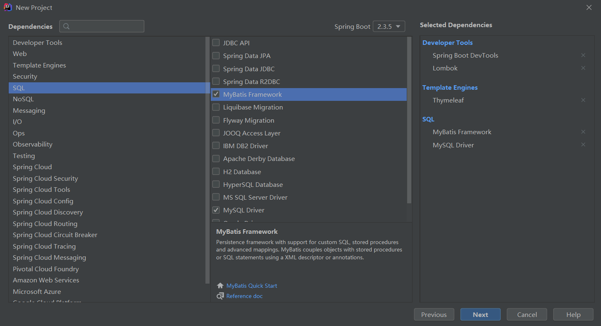

#### 	图片1.2.1-1.0.3

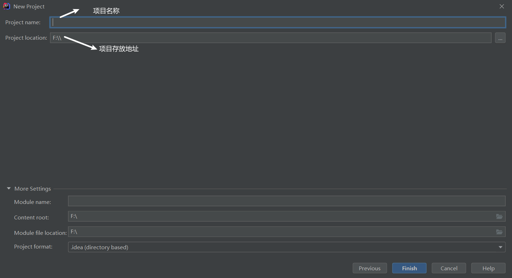


### 1.2.1-2 添加依赖
> ```java
> <dependency>
>             <groupId>org.springframework.boot</groupId>
>             <artifactId>spring-boot-starter-tomcat</artifactId>
>         </dependency>
>         <dependency>
>             <groupId>org.springframework.boot</groupId>
>             <artifactId>spring-boot-starter-web</artifactId>
> </dependency>
> ```

### 1.2.1-3 编写数据库对应的实体类(Entity)

> ```java
> package com.fron.textday01.mybatistest.emtity;
> 
> import lombok.Data;
> 
> @Data
> public class Employee {
> 
>  private Integer id;
>  private String last_name;
>  private String gender;
>  private String email;
> }
> ```
>
> **需要与数据库的参数名一致,如果不一致可以采用别名方式需在数据库语句处设置或使用settings开启识别**


### 1.2.1-4 配置.yml或.properties文件和xml文件

> ### .yml或.properties文件
>
> ```Java
> .yml 文件：
> spring:
> datasource:
> url: jdbc:mysql://localhost:3306/mybatis?serverTimezone=UTC
> username: root
> password: 123456
> driver-class-name: com.mysql.cj.jdbc.Driver
> 
> .properties 文件：
> spring.datasource.url=jdbc:mysql://localhost:3306/mybatis?serverTimezone=UTC
> spring.datasource.username=root
> spring.datasource.password=123456
> spring.datasource.driver-class-name=com.mysql.cj.jdbc.Driver
> ```
>
> ### 配置xml文件
>
> > #### MyBatis 总配置文件 mybatis-config.xml
> >
> > ```java
> > <?xml version="1.0" encoding="UTF-8" ?>
> > <!DOCTYPE configuration
> >   PUBLIC "-//mybatis.org//DTD Config 3.0//EN"
> >   "http://mybatis.org/dtd/mybatis-3-config.dtd">
> > <configuration>
> > <environments default="development">
> > <environment id="development">
> >      <transactionManager type="JDBC"/>
> >       <dataSource type="POOLED">
> >           <property name="driver" value="com.mysql.cj.jdbc.Driver"/>
> >           <property name="url" value="jdbc:mysql://localhost:3306/mybatis?serverTimezone=UTC&amp;useUnicode=true&amp;useSSL=true"/>
> >           <property name="username" value="root"/>
> >           <property name="password" value="123456"/>
> >       </dataSource>
> >    </environment>
> >   </environments>
> > <mappers>
> > <!--
> >      将写好的sql映射文件（mybatis-BlogMapper.xml）注册到全局配置文件（mybatis-config.xml）中
> >    -->
> >   <mapper resource="mybatis-BlogMapper.xml"/>
> >   </mappers>
> > </configuration>
> > ```
> > 
> >#### 配置MyBatis 数据库语句文件 mybatis-BlogMapper.xml(名称可自定义
> > 
> >```java
> > <?xml version="1.0" encoding="UTF-8" ?>
> > <!DOCTYPE mapper
> >   PUBLIC "-//mybatis.org//DTD Mapper 3.0//EN"
> >      "http://mybatis.org/dtd/mybatis-3-mapper.dtd">
> >    <mapper namespace="mybatis-BlogMapper.xml">
> > <!--
> >   namespace 名称空间
> >     resultType 返回值类型
> >     id 唯一标识
> >     #{id} 从传递过来的参数中取id
> >     -->
> >    <select id="selectBlog" resultType="com.fron.textday01.mybatistest.emtity.Employee">//修改为自己的实体类路径
> >    select * from tbl_employee where id = #{id}
> >    	//取别名写法
> > 	select id,last_name lastName,email,gender from tbl_employee where id = #{id}
> > </select>
> >  
> > </mapper>
> > ```


### 1.2.1 编写Controller类

> ```java
> package com.fron.textday01.mybatistest.controller;
> 
> import com.fron.textday01.mybatistest.emtity.Employee;
> import org.apache.ibatis.io.Resources;
> import org.apache.ibatis.session.SqlSession;
> import org.apache.ibatis.session.SqlSessionFactory;
> import org.apache.ibatis.session.SqlSessionFactoryBuilder;
> import org.springframework.stereotype.Controller;
> import org.springframework.web.bind.annotation.*;
> 
> import java.io.IOException;
> import java.io.InputStream;
> 
> @Controller
> public class MyBatisController {
> 
>  @GetMapping("/test")
>  @ResponseBody
>  public Employee MyBatisText() throws IOException {
>      Employee employee;
>      String resource = "mybatis-config.xml";
>      InputStream inputStream = Resources.getResourceAsStream(resource);
>      //Resources.getResourceAsStream(resource) MyBatis下工具类，用于加载资源文件
>      SqlSessionFactory sqlSessionFactory = new SqlSessionFactoryBuilder().build(inputStream);
>      //SqlSessionFactoryBuilder()的构造器调用的是build()方法
>      //因为是加载资源所以用InputStream流去接，然后配合SqlSessionFactoryBuilder(InputStream inputStream)构造器，返回SqlSessionFactory东西
> 
> 
>      SqlSession openSession = sqlSessionFactory.openSession();
> 
>      try{
>          employee = openSession.selectOne("mybatis-BlogMapper.xml.selectBlog", 1);
>          System.out.println(employee);
>      }finally {
>          openSession.close();
>      }
>      return employee;
>  }
> 
> }
> ```

###  1.2.1-6 Postman测试

#### 图片1.2.1-1.0.4

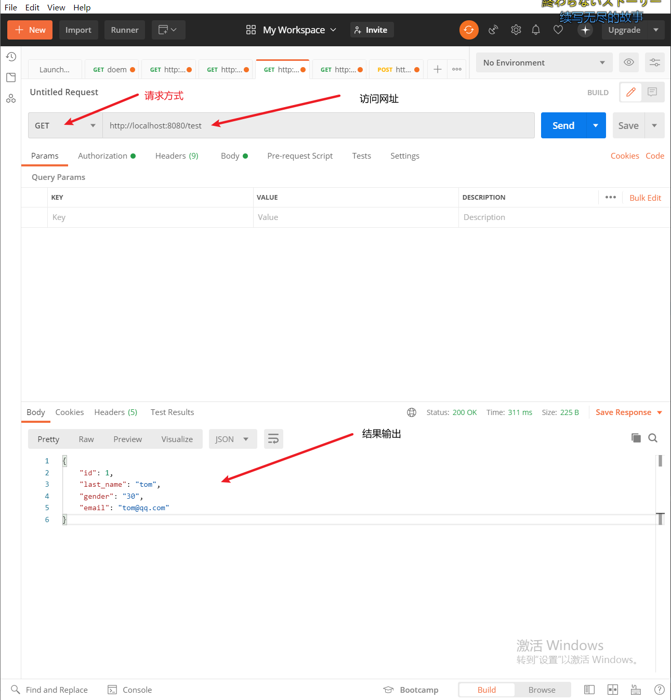

<hr style="margin:50px 0px;background-color:pink;"/>

## 1.2.2 接口式编程

###  1.2.2-1 好处

> 1.  确定返回的类型及参数类型
> 2.  为MyBatis的方法添加描述，做到见名知意

###  1.2.2-2 接口编写
> ####  接口编写规则
>
> ```java
> public interface MyBatisInterface {
> 
>  public Employee getEmpById(Integer id);
> 	方法权限 方法返回类型  方法名(方法参数列表)
> }
> 
> ```
>
> #### **返回值类型应与MyBatis的xml文件的数据库方法的返回类型保存一致，也就是与resultType相同**
>

###  1.2.2-3 绑定接口

> ####  接口绑定规则
>
> ```xml
> <?xml version="1.0" encoding="UTF-8" ?>
> <!DOCTYPE mapper
>            PUBLIC "-//mybatis.org//DTD Mapper 3.0//EN"
>            "http://mybatis.org/dtd/mybatis-3-mapper.dtd">
> <mapper namespace="com.fron.textday01.mybatistest.imi.MyBatisInterface">
>        <!--
>            namespace 名称空间 用于绑定接口名称
>        	resultType 返回值类型 返回值类型与接口方法
>        	id 唯一标识 用于绑定接口方法名称
>        	#{id} 从传递过来的参数中取id
>           -->
>        <select id="getEmpById" resultType="com.fron.textday01.mybatistest.emtity.Employee">
>            select * from tbl_employee where id = #{id}
>        </select>
> 
> </mapper>
> ```
>

###  1.2.2-4 Controller调用

> ####  方法调用写法
>
> ```Java
> public Employee MyMyBatisTexts() throws IOException {
>         Employee employee;
>         SqlSessionFactory sqlSessionFactory = getSqlSessionFactory();
>     	/**getSqlSessionFactory()是自己写的方法等同于
>     	String resource = "mybatis-config.xml";
>         InputStream inputStream = Resources.getResourceAsStream(resource);
>         SqlSessionFactory sqlSessionFactory = new SqlSessionFactoryBuilder().build(inputStream);
>     	*/
>     	//获取SqlSession对象
>         SqlSession openSession = sqlSessionFactory.openSession();
> 
>         try {
>             //接口会创建代理对象去执行调用的方法
>             MyBatisInterface myBatisInterface=openSession.getMapper(MyBatisInterface.class);
>             employee = myBatisInterface.getEmpById(1);
>         }finally {
>             openSession.close();
>         }
>         return employee;
>     }
> ```

<hr style="margin:50px 0px;background-color:pink;"/>

##  1.3.1 总结
>  #### 总结
>  > 1. 接口式编程
>  >    1. 原生  			Dao           ===>   DaoImpl
>  >    2. myBatis        Mapper    ===>   xxxMapper.xml
>  > 2. SqlSession 代表与数据库的一次会话，因此用完需关闭
>  > 3. SqlSession与connection一样且都属于线程不安全，每次使用都应该获取一个新的对象
>  > 4. 自己编写的接口没有实现类，但myBatis会为该接口生成一个代理对象
>  >    - 生成的代理对象会将接口和xml文件信息进行绑定
>  >    - 代理对象写法：
>  >       - 接口名称  接口对象  =   SqlSession对象.getMapper(接口名称.class)
>  > 5. 配置文件
>  >    1. myBatis的全局配置文件
>  >       
>  >       - 包含了数据库连接池信息，事务管理信息等....系统运行环境信息
>  >       - 该文件可以不需要，可以通过代码实现
>  >       
>  >    2. sql映射文件
>  >
>  >       - 保持了每一个sql语句的映射信息
>  >         - 实现将sql抽离，由程序员来编写
>  >       - 该文件必须存在，无法通过代码实现
>  >
>  > 


<hr style="margin:50px 0px;background-color:pink;"/>

#  2. 全局配置文件

##  2.1.1 配置文件标签

### 2.1.1-1 properties

> 1. 可使用properties去引入外部的properties配置文件的内容
>    - resource 用于引入类路径下的资源
>    - url 引入网络路径或磁盘路径下的资源

#### 2.1.1-1 properties的使用

> ```xml
> <properties resource="application.properties"></properties>//引用springboot配置文件
>  <environments default="development">
>         <environment id="development">
>             <transactionManager type="JDBC"/>
>          <dataSource type="POOLED">
>     			//value内写properties文件中与name对应的参数 格式:${properties对应数据}
>                 <property name="driver" value="${spring.datasource.driver-class-name}"/>
>                 <property name="url" value="${spring.datasource.url}"/>
>                 <property name="username" value="${spring.datasource.username}"/>
>                 <property name="password" value="${spring.datasource.password}"/>
>             </dataSource>
>         </environment>
>     </environments>
>    ```

<hr style="margin:50px 0px;background-color:pink;"/>

### 2.1.2 settings

> 1. 包含许多重要的设置项
>    - setting: 用于设置每一个重要的设置项
>    - name: 设置项名
>    - value: 设置取值项
>      - cacheEnabled
>        - 影响所有映射器中的配置缓存的全局开关
>          - 有效值为true/false ，默认值为true
>      - lazyLoadinEnabled
>        - 延迟加载全局开关
>          - 开启时，所有关联对象都会延迟加载
>          - 特定关联时可通过设置fetchType属性来覆盖该项的开关状态
>            - 有效值为true/false ，默认值为false
>      - useColumnLabel
>        - 使用列标签替代别名
>          - 不同驱动表现不同，具体可参照相关驱动文档去使用
>            - 有效值为true/false ，默认值为true
>      - defaultStatementTimeout
>        - 设置超时时间
>          - 决定了驱动等待数据库响应的秒数
>            - 有效值为Any positive integer ，默认值为Not Set(null)
>      - mapUnderscoreToCamelCase
>        - 是否开启自动驼峰命名法规则(camel case)映射
>          - 即经典数据库列名A_COLUMN到经典Java属性名aColumn的类似映射
>            - 有效值为true/false ，默认值为false

#### 2.1.2-1 settings的使用

> ```xml
> <settings>
>         <setting name="" value=""/>
> </settings>
> ```
>
> **放在environments标签上面**

<hr style="margin:50px 0px;background-color:pink;"/>

### 2.1.3 typeAliases

> 1. 别名处理器：可为某个Java类型取别名，别名不区分大小写
>    - typeAlias 可为某个Java类型取别名
>      - type 指定需要起别名的类型全类名；默认别名是类名小写
>      - alias 指定新的别名
>    - package 可为某个包下的所有类型批量写别名
>      - name 指定包名(为当前包以及下面所有的后代包的每一个类都起默认别名(类名小写))
>    - @Alias 可在package方法下出现别名冲突时使用，为冲突类重新定义别名

#### 2.1.3-1 typeAlias的使用
> ```xml
>     <typeAliases>
>         <typeAlias type="" alias=""></typeAlias>
>     </typeAliases>
> ```
>
> **放在environments标签上面**

#### 2.1.3-2 package的使用

> ```xml
> <typeAliases>
>         <package name="com.mybatisday02.properties.emtity"/>
> </typeAliases>
> ```
>
> **放在environments标签上面**

#### 2.1.3-3 已存在别名图示

> **不要与官方保留的别名相同，以免保存**

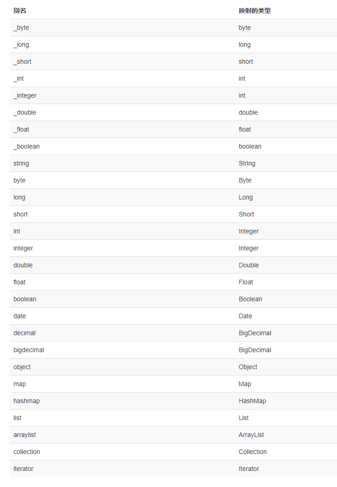

<hr style="margin:50px 0px;background-color:pink;"/>

### 2.1.4 typeHandlers

> 1. 类型映射处理器
>
> **从 3.4.5 开始，MyBatis 默认支持 JSR-310（日期和时间 API） 。**

#### 2.1.4-1 默认类型处理器

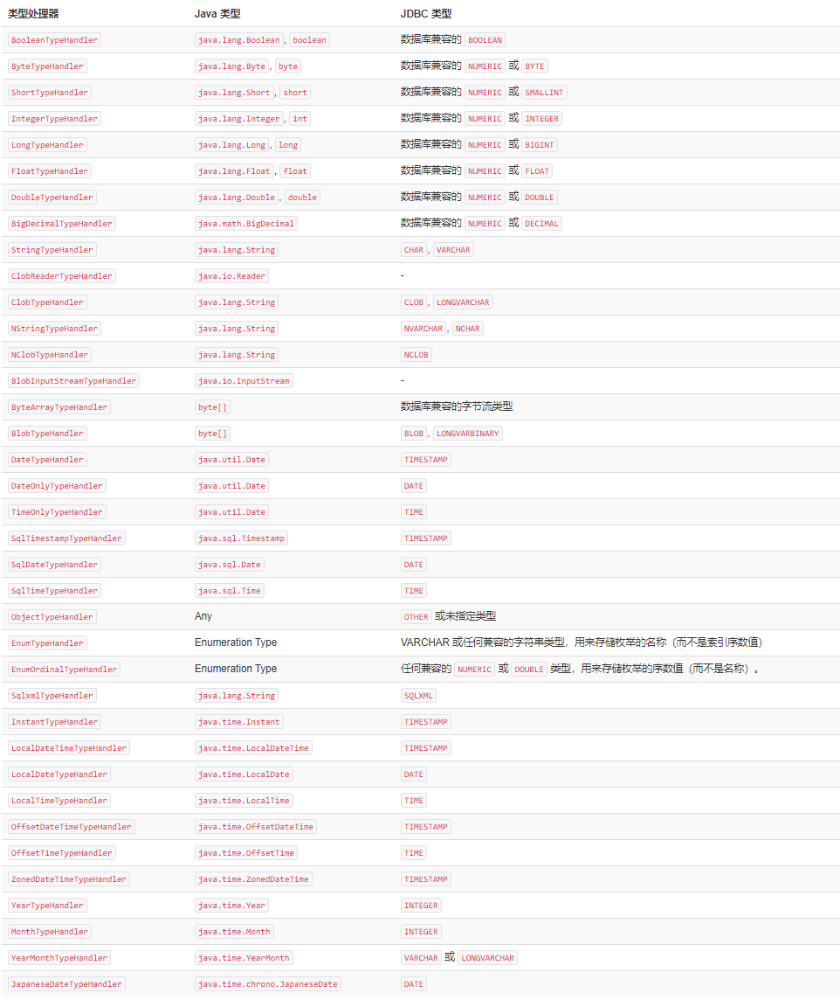

<hr style="margin:50px 0px;background-color:pink;"/>

### 2.1.5 plugins

> 1. 允许你在映射语句执行过程中的某一点进行拦截调用，
>    - 允许拦截的方法调用包括
>      - Executor (update, query, flushStatements, commit, rollback, getTransaction, close, isClosed)
>      - ParameterHandler (getParameterObject, setParameters)
>      - ResultSetHandler (handleResultSets, handleOutputParameters)
>      - StatementHandler (prepare, parameterize, batch, update, query)

<hr style="margin:50px 0px;background-color:pink;"/>

### 2.1.6 environments

> 1. ​	环境配置，mybatis可以配置多种环境，default用于指定使用哪种环境，可达到快速切换
>
>    - environment 配置具体的环境信息，id是该环境的唯一标识供default快速切换
>
>      - transactionManager 事务管理器
>
>        -  type 事物管理器类型，有两个参数选择
>
>          - JDBC  (JdbcTransactionFactory) 
>
>            - 直接使用了 JDBC 的提交和回滚设施，它依赖从数据源获得的连接来管理事务作用域
>
>          - MANAGED ( ManagedTransactionFactory) 
>
>            - 让容器来管理事务的整个生命周期（比如 JEE 应用服务器的上下文）。 默认情况下它会关闭连接。然而一些容器并不希望连接被关闭，因此需要将 closeConnection 属性设置为 false 来阻止默认的关闭行为
>
>              - ```xml
>                <transactionManager type="MANAGED">
>                  <property name="closeConnection" value="false"/>
>                </transactionManager>
>                ```
>
>                
>
>        - 自定义事务管理器 通过实现TransactionFactory接口 type指定为全类名
>                                                            
>      - dataSource 数据源
>                                                            
>        - type 数据源类型
>          - UNPOOLED (UnpooledDataSourceFactory )
>            - 数据源的实现会每次请求时打开和关闭连接
>          - POOLED(PooledDataSourceFactory)
>            - 数据源的实现利用“池”的概念将 JDBC 连接对象组织起来，避免了创建新的连接实例时所必需的初始化和认证时间
>          - JNDI (JndiDataSourceFactory)
>            - 数据源实现是为了能在如 EJB 或应用服务器这类容器中使用，容器可以集中或在外部配置数据源，然后放置一个 JNDI 上下文的数据源引用
>        - 自定义事务管理器 通过实现DataSourceFactory接口 type指定为全类名

<hr style="margin:50px 0px;background-color:pink;"/>

### 2.1.7 databaseldProvider

> 1. 多数据库支持
>    - type = “DB_VENDOR”  (VendorDatabaseIdProvider)
>      - 获取数据库厂商的标识(驱动 getDatabaseProductName)，mybatis会根据标识执行对应sql语句
>
> **放在environments标签下面**

#### 2.1.7-1 databaseldProvider使用

> ```xml
> <databaseIdProvider type="DB_VENDOR">
>     <!--为不同厂商起别名-->
>         <property name="MySQL" value="mysql"/>
>         <property name="Oracle" value="oracle"/>
>         <property name="SQL Server" value="sqlserver"/>
>     </databaseIdProvider>
> ```
> 
> **在select标签中使用databaseId来确定使用的厂商**

<hr style="margin:50px 0px;background-color:pink;"/>

### 2.1.8 mapper

> 1. 注册sql映射
>    - resource 引用类路径下的sql映射文件
>    - url 引用磁盘或网络路径下的sql映射文件
>    - class 引用(注册)接口
>      - 有sql映射文件，且映射文件与接口同名，并放在与接口同一目录下
>      - 没有sql映射文件，所有的sql都是利用注解写在接口上的，使用注解@Select
>
> 

#### 2.1.8-1 mapper @Select的使用

> ##### 接口
>
> ```xml
> <mappers>
>         <mapper resource="接口全类名"/>
>  </mappers>
> ```
>
> ##### 配置文件
>
> ```java 
> public interface MyBatisInterface {
> 
> 	@Select("sql语句")
> 	@Select(" select * from tbl_employee where id = #{id}")
>     public 返回类型 方法名称(参数类型 参数名称);
> 
> }
> 
> ```
>
> **简单的不重要的可以使用这种方式**

#### 2.1.8-2 mapper package的使用

> 1. 批量注册
>
>    - 注册规则class 的一样
>
>    > #### 写法
>    >
>    > ```xml
>    > <package name="包名"/>
>    > ```

<hr style="margin:50px 0px;background-color:pink;"/>

# 3. 映射文件

## 3.1.1 接口

```Java
public interface MyBatisInterface {

    public Employee getEmpById(Integer id);

    public boolean addEmp(Employee employee);

    public void upDataEmp(Employee employee);

    public void deleteEmpById(Integer id);
}
```

<hr style="margin:50px 0px;background-color:pink;"/>

## 3.2.1 增删查改

> **允许增删改直接定义以下返回类型**
>
> - Integer
> - Long
> - Boolean

### 3.2.1-1 查询

**映射文件**

```xml
<select id="getEmpById" resultType="Employee">
        select * from tbl_employee where id = #{id}
    	select * from 需要的查询数据的表 where 需要查询的条件 = #{传来的参数}
 </select>
resultType 返回类型
id 与接口方法对应
```

### 3.2.1-2 添加

**映射文件**

```xml
<insert id="addEmp">
        insert into tbl_employee(last_name,email,gender)
        value (#{lastName},#{email},#{gender})
    
    	insert into 需要的添加数据的表(需要查询的表的属性) vaule (#{传来的参数})
</insert>
```

### 3.2.1-3 修改

**映射文件**

```xml
<update id="upDataEmp">
        update tbl_employee set last_name=#{lastName},email=#{email},gender=#{gender} where id=#{id}
    	updata 需要改动数据的表 set 需要修改的表参数=#{传来的参数} where 需要修改的数据的唯一标识(一般是id) = #{传来的参数}
</update>
```

### 3.2.1-4 删除

**映射文件**

```xml
<delete id="deleteEmpById">
   delete from tbl_employee where id=#{id}
   delete from 需要删除数据的表 where 需要删除的数据的唯一标识(一般是id) = #{传来的参数}
</delete>
```


<hr style="margin:50px 0px;background-color:pink;"/>

## 3.3.1 调用

### 3.3.1-1 查询

```java
@RequestMapping("/tests")
@ResponseBody
    public Employee MyMyBatisTexts() throws IOException {
        Employee employee;
        SqlSessionFactory sqlSessionFactory = getSqlSessionFactory();
        SqlSession openSession = sqlSessionFactory.openSession();

        try {
            MyBatisInterface myBatisInterface=openSession.getMapper(MyBatisInterface.class);
            employee = myBatisInterface.getEmpById(2={需要查询的参数id});
        }finally {
            openSession.close();
        }
        return employee;
    }
```

### 3.3.1-2 添加

```java
@RequestMapping("/test2s")
    @ResponseBody
    public String MyBatisUpDataText1s() throws IOException {
        Employee employee = new Employee(null,"cc","50","VV@qq.com");
        employee.setId(2);
        SqlSessionFactory sqlSessionFactory = getSqlSessionFactory();
        SqlSession openSession = sqlSessionFactory.openSession(true);//开启推送
        System.out.println(employee.toString());
        try {
            MyBatisInterface myBatisInterface=openSession.getMapper(MyBatisInterface.class);
            myBatisInterface.addEmp(employee);
//            openSession.commit();//如果在 sqlSessionFactory.openSession()没有开启，则需手动推送
        }finally {
            openSession.close();
        }

        return "111";
    }
```

### 3.3.1-3 修改

```java
@RequestMapping("/test2s")
    @ResponseBody
    public String MyBatisUpDataText1s() throws IOException {
        Employee employee = new Employee("1","cc","50","VV@qq.com");
        employee.setId(2);
        SqlSessionFactory sqlSessionFactory = getSqlSessionFactory();
        SqlSession openSession = sqlSessionFactory.openSession(true);//开启推送
        System.out.println(employee.toString());
        try {
            MyBatisInterface myBatisInterface=openSession.getMapper(MyBatisInterface.class);
            myBatisInterface.upDataEmp(employee);
//            openSession.commit();//如果在 sqlSessionFactory.openSession()没有开启，则需手动推送
        }finally {
            openSession.close();
        }

        return "111";
    }
```

### 3.3.1-4 删除

```java
@RequestMapping("/test3s")
    @ResponseBody
    public String MyBatisDeleteText1s() throws IOException {

        SqlSessionFactory sqlSessionFactory = getSqlSessionFactory();
        SqlSession openSession = sqlSessionFactory.openSession();
        try {
            MyBatisInterface myBatisInterface=openSession.getMapper(MyBatisInterface.class);
            myBatisInterface.deleteEmpById(2);
            openSession.commit();
        }finally {
            openSession.close();
        }

        return "111";
    }
```

<hr style="margin:50px 0px;background-color:pink;"/>

## 3.4.1 标签简介

> 1. cache 命名空间的二级缓存
> 2. cache-ref 其他命名空间缓存配置的引用
> 3. resultMap 自定义结果集映射
> 4. parameterMap 已废弃 老式风格的参数映射
> 5. sql 抽取可重用语句块
> 6. insert 映射添加语句
> 7. update 映射修改语句
> 8. delete 映射删除语句
> 9. select  映射查询语句

### 3.4.1-1 select

> Select 定义查询操作
>
> - id
>   - 唯一标识符
>     - 用于引用这句语句，需要与接口中的方法名完全一致
> - parameterType
>   - 可以不传，myBaits会根据typeHandler自动推断
> - resultType
>   - 返回值类型
>     - 别名或者全称，如果是集合，就使用集合中元素类型
>     - 不能与resultMap同时使用

### 3.4.1-1 补充 关于List的使用

> **在使用List装返回结果时，要注意在xml文件中的写法**

```xml
> resultType处不写List,而是返回类型

<select id="getEmpByLastNameLike" resultType="Employee">
        select * from tbl_employee where last_name like #{lastName}
 </select>
```

> **在使用List装返回结果时，要注意在接口文件中的写法**

```java 
> 返回结果处使用List<返回类型>来装
    
public List<Employee> getEmpByLastNameLike(String lastName);
```


>  **在mybatis中，会将返回结果默认使用集合装好所以在xml中的resultType处不使用List**


#### 3.4.1-1.# select封装map

##### 3.4.1-1.#-1 接口

```java
@MapKey("id")//设置map的key使用什么属性填充
public Map<Integer,Employee> getEmpByLastName(String lastName);
```

##### 3.4.1-1.#-2 配置文件

```xml
 <select id="getEmpByLastName" resultType="Employee">
        select * from tbl_employee where last_name like #{lastName}
 </select>
```

#### 3.4.1-1.# resultMap

> resultMap 自定义映射规则

##### 3.4.1-1.#-1 写法

```xml
// id 唯一标识
// type 自定义规则的Java类型
<resultMap id="ecm" type="Employee">
    // id 用于定义主键，在底层实现时会有优化
    // column 指定那一列
    // property 指定对应的JavaBean属性
        <id column="id" property="id"></id>
    // result 用于定义普通列封装规则
    // 如果只写与数据库不同的列的话，mybatis会自动封装，但是一般建议写了就全写
        <result column="last_name" property="lastName"></result>
        <result column="email" property="email"></result>
        <result column="gender" property="gender"></result>
</resultMap>


//resultMap 绑定上面resultMap的id
    <select id="getEmpById" resultMap="ecm">
        select * from tbl_employee where id = #{id}
    </select>
```

#### 3.4.1-1.# resultMap 关联查询

##### 3.4.1-1.#-1 创建部门数据库表

> ```sql
> CREATE TABLE tbl_dept(
> 	id INT(11) PRIMARY KEY AUTO_INCREMENT,
> 	dept_name VARCHAR(255),
> )
> ```

##### 3.4.1-1.#-2 修改员工数据库表

> ```sql
> ALTER TABLE tbl_employee ADD COLUMN d_id INT(11)
>  
> ALTER TABLE 需要修改的数据库表 ADD COLUMN 需要添加的列 添加的类型
> ```

##### 3.4.1-1.#-3 查询员工及对应部门的数据语句

> ```sql
> SELECT e.id,e.email,e.gender,e.last_name,e.d_id,d.dept_name FROM tbl_employee e,tbl_dept d where e.d_id = d.id AND e.id = 1
> 
> //多表查询语句
> SELECT 别名1.xxx,别名1.xxx,别名2.xxx FROM 需要查询的表1 别名1,需要查询的表2 别名2 where 别名1.xxx = 别名2.xxx AND 别名1.xxx = 查询的条件
> ```

##### 3.4.1-1.#-4 创建部门类

> ```java
> package com.mybatisday02.properties.emtity;
> 
> import lombok.Data;
> 
> @Data
> public class Department {
>     private Integer id;
>     private String departName;
> }
> ```

##### 3.4.1-1.#-5 修改员工类

> ```java
> package com.mybatisday02.properties.emtity;
> 
> import lombok.Data;
> 
> @Data
> public class Employee {
> 
>     private Integer id;
>     private String lastName;
>     private String gender;
>     private String email;
>     private Integer d_id;
>     private Department department;
> 
> }
> ```

##### 3.4.1-1.#-6 修改xml文件

> **方法一 级联属性封装**
>
> ```xml
> <resultMap id="MyDifEmp" type="Employee">
>      <id column="id" property="id"></id>
>      <result column="last_name" property="lastName"></result>
>      <result column="email" property="email"></result>
>      <result column="gender" property="gender"></result>
>      <result column="d_id" property="d_id"></result>
>      <result column="id" property="department.id"></result>
>      <result column="dept_name" property="department.departName"></result>
>  </resultMap>
> 
>  <select id="getEmpAndDept" resultMap="MyDifEmp">
>      SELECT e.id,e.email,e.gender,e.last_name,e.d_id,d.dept_name FROM tbl_employee e,tbl_dept d where e.d_id = d.id AND e.id = #{id}
>  </select>
> ```
>
> **方法二  使用association标签** 
>
> ```Java
> <resultMap id="MyDifEmp" type="Employee">
>         <id column="id" property="id"></id>
>         <result column="last_name" property="lastName"></result>
>         <result column="email" property="email"></result>
>         <result column="gender" property="gender"></result>
>         <result column="d_id" property="d_id"></result>
>     	<!--
>     		association 可以指定联合的JavaBean对象
>     		property="联合的对象" 指定联合的对象
>     		javaType 指定这个属性对象的类型[不能省略]
>     	-->
>         <association property="department" javaType="com.mybatisday02.properties.emtity.Department">
>             <id column="id" property="id"></id>
>             <result column="dept_name" property="departName"></result>
>         </association>
>     </resultMap>
> 
>     <select id="getEmpAndDept" resultMap="MyDifEmp">
>         SELECT e.id,e.email,e.gender,e.last_name,e.d_id,d.dept_name FROM tbl_employee e,tbl_dept d where e.d_id = d.id AND e.id = #{id}
>     </select>
> ```
>
> **方法三 分步查询**
>
> **创建department对应的xml文件**
>
> ```xml
> <?xml version="1.0" encoding="UTF-8" ?>
> <!DOCTYPE mapper
>         PUBLIC "-//mybatis.org//DTD Mapper 3.0//EN"
>         "http://mybatis.org/dtd/mybatis-3-mapper.dtd">
> <mapper namespace="com.mybatisday02.properties.imi.MyBatisDepartmentInterface">
>     <select id="departById" resultType="com.mybatisday02.properties.emtity.Department">
>         SELECT id,dept_name departName FROM tbl_dept WHERE id = #{id}
>     </select>
> </mapper>
> ```
>
>  **修改mybatis-BlogMapper.xml配置文件**
>
> ```xml
> <resultMap id="MyEmpByStep" type="com.mybatisday02.properties.emtity.Employee">
>         <id column="id" property="id"></id>
>         <result column="last_name" property="lastName"></result>
>         <result column="email" property="email"></result>
>         <result column="gender" property="gender"></result>
>         <association
>                 property="department"
>                 select="com.mybatisday02.properties.imi.MyBatisDepartmentInterface.departById"
>                 column="d_id"
>         ></association>
>     </resultMap>
> 
>     <select id="getEmpByIdStep" resultMap="MyEmpByStep">
>         select * from tbl_employee where id = #{id}
>     </select>
> ```
>
> **将创建的department对应的xml文件加入主配置文件**
>
> ```xml
> <mappers>
>         <mapper resource="mybatis-BlogMapper.xml"/>
>         <mapper resource="mybatis-DepartMapper.xml"/>
> </mappers>	
> ```

##### 3.4.1-1.#-7 修改接口

>  **在接口中添加对应方法**
>  ```java
>  public Employee getEmpAndDept(Integer id);
>  ```
>
>  **方法三对应 创建Department的方法接口 **
>
>  ```java
>  package com.mybatisday02.properties.imi;
>  
>  import com.mybatisday02.properties.emtity.Department;
>  
>  public interface MyBatisDepartmentInterface {
>  
>      public Department departById(Integer id);
>  }
>  
>  ```

##### 3.4.1-1.#-8 编写Controller

> ```java
> 	@RequestMapping("/test6s")
>     @ResponseBody
>     public Employee MyBatisDeleteText6s() throws IOException {
>         Employee employee;
>         SqlSessionFactory sqlSessionFactory = getSqlSessionFactory();
>         SqlSession openSession = sqlSessionFactory.openSession();
>         try {
>             MyBatisInterface myBatisInterface=openSession.getMapper(MyBatisInterface.class);
>             //方法一与方法二相同方法不同写法
>             employee = myBatisInterface.getEmpAndDept(1);
>             //方法三
>             employee = myBatisInterface.getEmpByIdStep(1);
>             openSession.commit();
>         }finally {
>             openSession.close();
>         }
> 
>         return employee;
>     }
> ```


#### 3.4.1-1.# resultMap 关联查询-collection

#####　3.4.1-1.#-1 修改Department和Employee类

```Java

> Department
package com.mybatisday02.properties.emtity;

import lombok.Data;

import java.util.List;

@Data
public class Department {
    private Integer id;
    private String departName;
    private List<Employee> emps;
}

> Employee
package com.mybatisday02.properties.emtity;

import lombok.Data;

@Data
public class Employee {

    private Integer id;
    private String lastName;
    private String gender;
    private String email;
    private Integer d_id;

}

```

##### 3.4.1-1.#-2 编写接口方法

```Java
package com.mybatisday02.properties.imi;

import com.mybatisday02.properties.emtity.Department;

public interface MyBatisDepartmentInterface {
    public Department departByIdPlus(Integer id);
    
    // 方法二
    public Department departByIdStep(Integer id);
}

```

```java
package com.mybatisday02.properties.imi;


import com.mybatisday02.properties.emtity.Employee;
import org.apache.ibatis.annotations.MapKey;

import java.util.List;
import java.util.Map;

public interface MyBatisInterface {

    // 方法二
    public List<Employee> getEmpByDeptId(Integer id);
}

```


##### 3.4.1-1.#-3 编写xml文件

```xml
<resultMap id="departMessage" type="com.mybatisday02.properties.emtity.Department">
        <id column="did" property="id"/>
        <result column="dept_name" property="departName"></result>
        <collection property="emps" ofType="com.mybatisday02.properties.emtity.Employee">
            <id column="id" property="id"/>
            <result column="last_name" property="lastName"></result>
            <result column="gender" property="gender"></result>
            <result column="email" property="email"></result>
            <result column="d_id" property="d_id"></result>
        </collection>
    </resultMap>

    
    <select id="departByIdPlus" resultMap="departMessage">
        SELECT * FROM tbl_dept d LEFT JOIN tbl_employee e ON d.did = e.d_id WHERE d.did = #{id}
    </select>

// 方法二
column 与实体类对应
property 与数据库对应
select 调用查询方法
collection 中的 column 需要的参数列
<!--
	扩展：多列值传递，
		 将多列的值封装到map传递
	写法：
		column="{key1 = column1,key2 = column2}"

	fetchType = "lazy" 默认为lazy
			表示使用延迟加载
			lazy  延迟加载
			eager 立即加载
-->
<resultMap id="departStep" type="com.mybatisday02.properties.emtity.Department">
        <id column="did" property="did"></id>

        <result column="dept_name" property="depart_name"></result>
        <collection property="emps" select ="com.mybatisday02.properties.imi.MyBatisInterface.getEmpByDeptId"
                    column="did"/column="{id=did}" fetchType ="lazy">
        </collection>
    </resultMap>
    <select id="departByIdStep" resultMap="departStep">
        select did,dept_name departName from tbl_dept where did=#{id}
    </select>
```


#### 3.4.1-1.# select元素属性

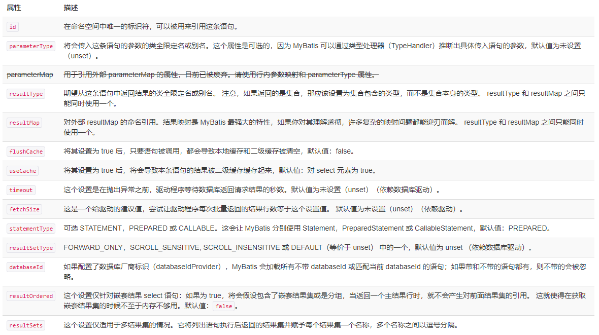


### 3.4.1-1.# discriminator

**写法： <discriminator javaType = "列值对应的Java类型" column = "指定需要判断的列"></discriminator>**

> **鉴别器**
>
> - mybatis 使用discriminator判断某列的值，然后根据某列的值改变封装行为

#### 3.4.1-1.# 编写xml文件

> ```xml
> <resultMap id="EmpByIds" type="com.mybatisday02.properties.emtity.Employee">
>         <id column="id" property="id"></id>
>         <result column="last_name" property="lastName"></result>
>         <result column="email" property="email"></result>
>         <result column="gender" property="gender"></result>
> 
>     <!--
> 		column   需要判断的列
> 		javaType 判断列的类型
>  		value    判断的条件
> 		resultType 返回值类型 一定要有，也可以使用resultMap
> 	-->
>         <discriminator javaType 判断列的类型="string" column="gender">
>             
>             <case value="0" resultType="Employee">
>                 <association
>                         property="department"
>                         select="com.mybatisday02.properties.imi.MyBatisDepartmentInterface.departById"
>                         column="d_id"
>                 ></association>
>             </case>
>             
>             <case value="1" resultType="Employee">
>                 <id column="id" property="id"></id>
>                 <result column="last_name" property="lastName"></result>
>                 <result column="last_name" property="email"></result>
>                 <result column="gender" property="gender"></result>
>             </case>
>         </discriminator>
>     </resultMap>
> 
>     <select id="getEmpByIds" resultMap="EmpByIds">
>         select * from tbl_employee where id = #{id}
>     </select>
> ```

<hr style="margin:50px 0px;background-color:pink;"/>

#  4. 参数处理

## 4.1.1 单参数处理

> **#{参数名} ： 取出参数值且不做任何处理**


## 4.2.1 多参数处理

> 1. 多参数处理时会被封装为map
> 2. #{}即从map中获取指定的key的值
>    - key ： param1.......paramX 或 参数索引
>    - value: 传入的参数值


## 4.3.1 命名参数

> 1. 明确指定封装参数时map的key: @Param("命名的名称")
>
>    - key 使用@Param直接指定的值
>    - value 参数值
>
>    **#{指定的key}取出定义的参数**


## 4.4.1 POJO

> 如果多个参数符合业务逻辑模型，就可以直接传入pojo
>
> #{属性名}： 取出传入的pojo的属性值


## 4.5.1 Map

> 如果多个参数不是业务模型中的数据，没有对应的pojo且不经常使用的数据为了方便可以直接传入map
>
> #{key} 取出map对应的值


## 4.6.1 To

> 如果多个参数不是业务模型中的数据,但是经常使用,因此可以编写一个To(Transfer Object)数据传输对象
>
> **类似下面的**
>
> ```java
> Page{
>     int index;
>     int size
> }
> ```
>


## 4.7.1 Collection(List,Set)

> 在使用Collection(List,Set)类型或数组时，也会做特殊处理，将传入的list或数组封装到map中
>
> - Key: Collection(collection)
>   - 如果是List可以使用 key(list)
>   - 如果是数组可以使用key(array)
>
> #### 用法
>
> ```Java
> public Employee getEmpById(List<Integer> ids)
> 
> 取值：#{list[需要取的参数在list中的下标]}
> ```
>
> 

## 4.8.1 源码解析

> ```java
> 
> 
> 
> (@Param("id")Integer id,@Param("lastName")String lastName)
> names ：{0=id,1=lastName}在构造器中确定好的
> 	1.获取每一个标了param注解的参数的@Param的值：id,lastName 赋值给name；
>     2.每次解析一个参数给map中保存信息:(key:参数索引，value:name的值)
> 		name的值
>             标注了param注解:注解的值
>             没有标注:
> 				全局配置:useActualParamName(jdk1.8):name = 参数名
>                 name = map.size();相当于当前元素的索引
>         
>   public ParamNameResolver(Configuration config, Method method) {
>     this.useActualParamName = config.isUseActualParamName();
>     final Class<?>[] paramTypes = method.getParameterTypes();
>     final Annotation[][] paramAnnotations = method.getParameterAnnotations();
>     final SortedMap<Integer, String> map = new TreeMap<>();
>     int paramCount = paramAnnotations.length;
>     // get names from @Param annotations
>     for (int paramIndex = 0; paramIndex < paramCount; paramIndex++) {
>       if (isSpecialParameter(paramTypes[paramIndex])) {
>         // skip special parameters
>         continue;
>       }
>       String name = null;
>       for (Annotation annotation : paramAnnotations[paramIndex]) {
>         if (annotation instanceof Param) {
>           hasParamAnnotation = true;
>           name = ((Param) annotation).value();
>           break;
>         }
>       }
>       if (name == null) {
>         // @Param was not specified.
>         if (useActualParamName) {
>           name = getActualParamName(method, paramIndex);
>         }
>         if (name == null) {
>           // use the parameter index as the name ("0", "1", ...)
>           // gcode issue #71
>           name = String.valueOf(map.size());
>         }
>       }
>       map.put(paramIndex, name);
>     }
>     names = Collections.unmodifiableSortedMap(map);
>   }
> 
> 
> 
> public Object getNamedParams(Object[] args) {
>     final int paramCount = names.size();
>     //如果参数为空则直接返回
>     if (args == null || paramCount == 0) {
>       return null;
>     //如果参数只有一个，并且没有Param注解;ages[0]:单参数直接返回
>     } else if (!hasParamAnnotation && paramCount == 1) {
>       Object value = args[names.firstKey()];
>       return wrapToMapIfCollection(value, useActualParamName ? names.get(0) : null);
>     //多个参数或含有注解Param
>     } else {
>       final Map<String, Object> param = new ParamMap<>();
>       int i = 0;
>       //遍历names集合:{0=id,1=lastName}
>       for (Map.Entry<Integer, String> entry : names.entrySet()) {
>         // names集合的value作为key； names集合的key作为args取值的参考args[0]
>         //{id=args[0],lastName=args[1]}
>         param.put(entry.getValue(), args[entry.getKey()]);
>         // add generic param names (param1, param2, ...)
>         // 额外将每一个参数也保存到map中,使用新的key：param1....paramX
>         // 效果：有Param注解可以使用#{指定的key}和#{param1}
>         final String genericParamName = GENERIC_NAME_PREFIX + (i + 1);
>         // ensure not to overwrite parameter named with @Param
>         if (!names.containsValue(genericParamName)) {
>           param.put(genericParamName, args[entry.getKey()]);
>         }
>         i++;
>       }
>       return param;
>     }
>   }
> ```

## 4.9.1 #{}和${}的区别

> #{} 可以获取map中的值或pojo对象属性的值
>
> ${} 可以获取map中的值或pojo对象属性的值

#### 4.9.1-1 区别

1. **#{}**
   - 是以预编译的形式，将参数设置到sql语句中;PreparedStatement;防止sql注入
   - 可以规定参数的一些规则
     - JavaType
     - jdbcType
     - mode(存储过程)
     - numericScale
     - resultMap
     - typeHandler
     - jdbcTypeName
     - expression(未来准备支持的功能)
2. ${}
   - 取出值直接拼接在sql语句中；会出现sql注入问题

**在大多数情况下会使用#{}，在jdbc中不支持使用占位符的地方可以使用${}进行取值但一般使用${}时应该是编写者自己输值的情况**

#### 4.9.1-2 jdbc在特定条件的使用

> 在数据为null的时候，有些数据库可能无法识别mybatis对null的默认处理。
>
> 
>
> JdbcType OTHER：无效类型；因为myBatis对所有的null的映射是原生JdbcType OTHER，Oracle不能正确的识别处理
>
> 
>
> 由于全局配置中 jdbcTypeForNull=OTHER；oracle不支持
>
> 1. #{数据名称,jdbcType=OTHER}
> 2. jdbcTypeForNull=NULL
>    - <setting name="jdbcTypeForNull" value="null"></setting>


# 5. 动态Sql

> 1. 动态SQL是MyBatis强大特性之一，简化了拼接SQL的操作
> 2. 动态SQL元素和使用JSTL或其他类似基于XML的文本处理器相似
> 3. MyBatis采用功能强大的基于OGNL的表达式来简化操作
>    - if
>    - chooose（when ，otherwise）
>    - trim (where , set)
>    - foreach


### 5.1.1 if和trim

####　5.1.1-1 if和trim的使用

> 查询时如果某些条件没带造成了sql拼接问题，一下有三种解决方案
>
> 1. 给where后面加1=1，以后的条件都用and xxx
> 2. mybatis使用where标签来将所有的查询条件包括在内。mybatis会将where标签中拼接的sql，多余的and或or自动省略，但是只会省略头部的and和or
> 3. mybatis使用trim进行字符串的截取

```xml
<?xml version="1.0" encoding="UTF-8" ?>
<!DOCTYPE mapper
        PUBLIC "-//mybatis.org//DTD Mapper 3.0//EN"
        "http://mybatis.org/dtd/mybatis-3-mapper.dtd">
<mapper namespace="com.mybatisday02.properties.imi.MyBatisDynamicSQL">
    <!--

    -->
    方法一：
    <select id="getEmpByConditionIf" resultType="com.mybatisday02.properties.emtity.Employee">
        
        select * from  tbl_employee where 1 = 1
        <!--
            test: 判断表达式(OGML)
            OGML表达式参照官方文档或#补充系列
            从参数中取值进行判断

            遇到特殊字符应该去写转译字符
        -->
        <if test="id!=null">
           and id = #{id}
        </if>
        <if test="lastName != null and lastName != &quot;&quot;">
            and last_name like #{lastName}
        </if>
        <if test="email != '' and email.trim() != '' and email != null">
            and email = #{email}
        </if>
        <!--
            ognl会进行字符串与数字的转换判断 ”0“ == 0
        -->
        <if test="gender == 0 or gender == 1">
            and gender = #{gender}
        </if>
    </select>
    
    方法二：
    <select id="getEmpByConditionIf" resultType="com.mybatisday02.properties.emtity.Employee">
        
        select * from  tbl_employee
        <!--
            test: 判断表达式(OGML)
            OGML表达式参照官方文档或#补充系列
            从参数中取值进行判断

            遇到特殊字符应该去写转译字符
        -->
        <where>
        	<if test="id!=null">
           		and id = #{id}
        	</if>
        	<if test="lastName != null and lastName != &quot;&quot;">
            	and last_name like #{lastName}
        	</if>
        	<if test="email != '' and email.trim() != '' and email != null">
            	and email = #{email}
        	</if>
        	<!--
            	ognl会进行字符串与数字的转换判断 ”0“ == 0
        	-->
        	<if test="gender == 0 or gender == 1">
            	and gender = #{gender}
        	</if>
        </where>
    </select>
    
    方法三：trim通用与大多拼接语句
    <select id="getEmpByConditionIf" resultType="com.mybatisday02.properties.emtity.Employee">
        select * from  tbl_employee
        <!--
            后面多出的and或or where标签解决不了因此使用trim
                trim标签体中是整个字符串拼串后的结果
                前缀
            prefix = ”“:
                  prefix给拼接后的字符串加一个前缀
            prefixOverrides = ”“
                  前缀覆盖: 去掉整个字符串前面多余的字符
                后缀
            suffix = ”“
                  suffix给拼串的整个字符加个后缀
            suffixOverrides = ”“
                  后缀覆盖: 去掉整个字符串后面多余的字符
        -->
        <trim prefix="where" suffixOverrides="and">
            <if test="id!=null">
                 id = #{id} and
            </if>
            <if test="lastName != null and lastName != &quot;&quot;">
                 last_name like #{lastName} and
            </if>
            <if test="email != '' and email.trim() != '' and email != null">
                 email = #{email} and
            </if>
            <!--
                ognl会进行字符串与数字的转换判断 ”0“ == 0
            -->
            <if test="gender == 0 or gender == 1">
                 gender = #{gender} and
            </if>
        </trim>
    </select>


</mapper>
```


### 5.2.1 choose

#### 5.2.1 choose的使用

> 分支选择；带有break的switch-case
>
> 1. 在choose中通过判断when如果满足就执行，如果都不满足就执行otherwise

```xml
<select id="getEmpByConditionChoose" resultType="com.mybatisday02.properties.emtity.Employee">
        select * from  tbl_employee
        <where>
            <choose>
                <when test="id != null">
                    id=#{id}
                </when>
                <when test="lastName != null and lastName!=&quot;&quot;">
                    last_name like #{lastName}
                </when>
                <when test="email != null and email!=&quot;&quot;">
                    email =#{email}
                </when>
                <otherwise>
                    gender = 0
                </otherwise>
            </choose>
        </where>
    </select>
```


## 5.3.1 set

### 5.3.1-1 set的使用

> 配合if实现选择性修改属性
>
> - 不在set中使用if进行选择时，会发现报出语句错误的问题
>   - 错误语句 update tbl_employee  SET last_name = ?,gender = ? ,where id = ?
> - 加上set后会自动屏蔽最后一个逗号(,)
>   - update tbl_employee  SET last_name = ?,gender = ?  where id = ?

```xml
<update id="upDataEmpByCondition">
        update tbl_employee
        <set>
            <if test="lastName != null and lastName != &quot;&quot;">
                last_name = #{lastName},
            </if>
            <if test="email != null and email != &quot;&quot;">
                email = #{email},
            </if>
            <if test="gender!=null and gender != &quot;&quot;">
                gender = #{gender},
            </if>
        </set>
        where id = #{id}
    </update>
```


## 5.4.1 foreach

### 5.3.1-1 foreach的使用

> 用于循环遍历参数类型为map，Arrray和map的参数
>
> 1. collection 指定要遍历的集合
>    - list类型的参数会特殊处理封装到map中，map的key就叫list
> 2. item 将当前遍历出的元素赋值到指定的变量
> 3. separator 每个元素之间的分隔符
> 4. open 遍历所有结果拼接一个开始的字符
> 5. close 遍历所有结果拼接一个结尾字符
> 6. index 索引
>    - 遍历list的时候index是索引    
>    - 遍历map的时候index表示map的key，item为map的值
> 7. #{变量名} 取出变量的值也就是当前遍历出的元素

```xml
> 批量查询
<select id="departByIdSteps" resultType="com.mybatisday02.properties.emtity.Employee">
        select * from tbl_employee where id in
        <foreach collection="ids" item="item_id" separator=","
        open="(" close=")">
            #{item_id}
        </foreach>
    </select>

> 批量添加 但是只有MySQL支持该方式
  <insert id="addEmps">
        insert into tbl_employee(last_name,email,gender,d_id)
        value <foreach collection="emps" item="item_emps" separator=","
    >
        (#{item_emps.lastName},#{item_emps.email},#{item_emps.gender},#{item_emps.d_id})
    </foreach>
    </insert>
> 批量添加方法二
<insert id="addEmps">
         <foreach collection="emps" item="item_emps" separator=";">
             insert into tbl_employee(last_name,email,gender,d_id)
             value (#{item_emps.lastName},#{item_emps.email},#{item_emps.gender},#{item_emps.d_id})
    </foreach>
    </insert>
```

```properties
//批量添加方法二需修改配置文件 开启多条语句同时执行
spring.datasource.url=jdbc:mysql://localhost:3306/mybatis?serverTimezone=UTC&useUnicode=true&useSSL=true&allowMultiQueries=true
```


# 6. 内置参数

> - mybatis 默认内置参数
>   - _parameter 代表整个参数
>     - 单个参数  _parameter就是这个参数
>     - 多个参数  参数会封装到map中；_parameter就代表这个map
>   - _databaseId 如果配置了databaseIdProvider标签
>     - _databaseId  代表当前数据库的别名


# 7. 抽取重用

> 1. sql 抽取：可将经常要查询的列名或插入用的列名抽取出来方便引用
>
>    - 写法  <sql id="XXXX>抽取的部分</sql>
>
> 2. include来引用抽取的sql
>
> 3. include可以自定义些property，在sql标签中就可以使用
>
>    - include-property：取值方式：
>
>      - <sql id="XXXX>${XXXX}</sql>
>
>    - <include refid="与sql的id对应">
>          <property name="属性名" value="属性值"/>
>      </include>
>
>      


#　８.缓存机制

## 8.1.1 两级缓存

> ##### 一级缓存和二级缓存
>
> 1. ​	默认情况下,只有一级缓存(SqlSession级别的缓存,也称为本地缓存)开启
> 2. 二级缓存需手动开启和配置,他是基于namespace级别的缓存
> 3. 为了提高扩展性, Mybatis 定义了缓存接口Cache,我们可以通过实现Cache接口来自定义二级缓存
>
> 
>
> ##### 二级缓存(全局缓存)
>

## 8.2.1 一级缓存

> ##### 一级缓存(本地缓存)  
>
> -  SqlSession级别的缓存一级缓存是一直开启的，无法手动关闭
> -  与数据库同一次会话期间查到的数据会放到本地缓存中，后面查询相同的数据，直接从缓存中取，而不会去查询数据库

### 8.2.1-1 一级缓存失效情况

> ##### 指没有使用到当前的一级缓存，需要向数据库重新请求
>
> #### 失效情况
>
> 1. sqlSession不同，处于不同会话相同查询的情况下
> 2. sqlSession相同，查询条件不同(当前缓存中尚不存在该数据)
> 3. sqlSession相同，查询之间存在增删改操作(这次操作可能会对当前数据有影响)
> 4. sqlSession相同，手动清理了缓存


```Java
> 失效情况一
SqlSession openSession1 = sqlSessionFactory.openSession();
MyBatisCache myBatisCache = openSession.getMapper(MyBatisCache.class);
List<Employee> empById1 = myBatisCache.getEmpById(1);

SqlSession openSession2 = sqlSessionFactory.openSession();
MyBatisCache myBatisCaches = openSession2.getMapper(MyBatisCache.class);
List<Employee> empById2 = myBatisCaches.getEmpById(1);

> 失效情况二
SqlSession openSession = sqlSessionFactory.openSession();
MyBatisCache myBatisCache = openSession.getMapper(MyBatisCache.class);

List<Employee> empById1 = myBatisCache.getEmpById(1);
List<Employee> empById2 = myBatisCache.getEmpById(2);

> 失效情况三
List<Employee> empById1 = myBatisCache.getEmpById(1);

myBatisCache.addEmp(new Employee(null,"casd","0","gsfa",0));

List<Employee> empById2 = myBatisCache.getEmpById(1);

> 失效情况四
List<Employee> empById1 = myBatisCache.getEmpById(1);
            
openSession.clearCache();// 清理缓存
            
List<Employee> empById2 = myBatisCache.getEmpById(1);
```


## 8.2.2 二级缓存

> - 基于namespace级别的缓存: 一个namespace对应一个二级缓存
> - 工作机制
>   - 一个会话，查询一条数据，这个数据会放到当前会话的一级缓存中
>   - 如果会话关闭；对应的一级缓存会被保存到二级缓存中，新的会话查询信息，就可以参照二级缓存中的内容
>   - 不同namespace查出的数据会放在自己对应的缓存中(map)

### 8.2.2-1  二级缓存的实现

> ##### 使用
>
> - 开启全局二级缓存 <setting name="cacheEnabled" value="true"/>
> - 在对应的xml文件中配置二级缓存 <cache></cache>
> - POJO需要实现序列化接口

```Java
在controller中 需要使得MyBatisCache的对象查询后将会话关闭，不然一级缓存中的数据无法加入二级缓存
		SqlSessionFactory sqlSessionFactory = getSqlSessionFactory();
        SqlSession openSession = sqlSessionFactory.openSession();
        SqlSession openSession2 = sqlSessionFactory.openSession();
        try {
            MyBatisCache myBatisCache = openSession.getMapper(MyBatisCache.class);
            MyBatisCache myBatisCaches = openSession2.getMapper(MyBatisCache.class);
            
            List<Employee> empById1 = myBatisCache.getEmpById(1);
            openSession.close();
			

            List<Employee> empById2 = myBatisCaches.getEmpById(1);
            openSession2.close();
            System.out.println("cc1:" + empById1);
            System.out.println("cc2:" + empById2);
        }
在xml文件中开启二级缓存
    <cache eviction="FIFO" flushInterval="300000" readOnly="false" size="1024" >
        <!--
            eviction 缓存回收策略
                LRU - 最近最少使用的,移除最长时间不被使用的对象
                FIFO - 先进先出,按对象加入缓存的顺序来移除他们
                SOFT - 软引用,移除基于垃圾回收器状态和软引用规则的对象
                WEAK - 弱引用,更积极地移除垃圾回收器状态和弱引用规则的对象
             flushInterval 缓存刷新间隔
                缓存多久清空一次,默认不清空,可通过设置毫秒值指定多久清空一次
             readOnly 是否只读
                true   只读     mybatis认为所有从缓存中获取数据的操作都是只读操作,不会修改数据
                               mybatis 为了加快获取速度，直接将数据在缓存中的引用交给用户.
                               速度快但不安全
                false  非只读   mybatis觉得获取的数据可能会被修改
                               mybatis会通过序列化&反序列的技术克隆一份新的数据给你.、
                               安全但速度慢
             size 缓存存放多少元素
             type = "" : 指定自定义缓存的全类名
                         实现Cache接口即可
        -->
    </cache>
```


## 8.3.1 与缓存相关数据

> 1. cacheEnabled 属性
>    - false 关闭缓存(二级缓存,不影响一级缓存)
>    - true 开启缓存
> 2. 每个select标签都有useCache 属性
>    - true 使用缓存
>    - false 不使用缓存(只影响二级缓存)
> 3. 每个增删改标签都有 flushCache 属性
>    - true 在增删改执行后会清空一二级缓存
>    - 查询标签默认为false，如果改为true，每次后都会清空缓存，缓存是没有被使用的
> 4. sqlSession.clearCache() 方法
>    - 只清空当前session的一级缓存
> 5. localCacheScope
>    - 本地缓存作用域:(一级缓存SESSION) 当前会话的所有记录保存到缓存中
>    - STATEMENT 可以关闭一级缓存

## 8.4.1 缓存流程图

> #### **流程步骤**
>
> 会话进入 -> 查询二级缓存 -> 存在则返回,不存在则进入当前会话的一级缓存中查找
>
> -> 存在则返回,不存在则查询数据库 -> 将查询数据存入一级缓存然后返回 
>
> -> 会话关闭,一级缓存中的内容进入二级缓存

 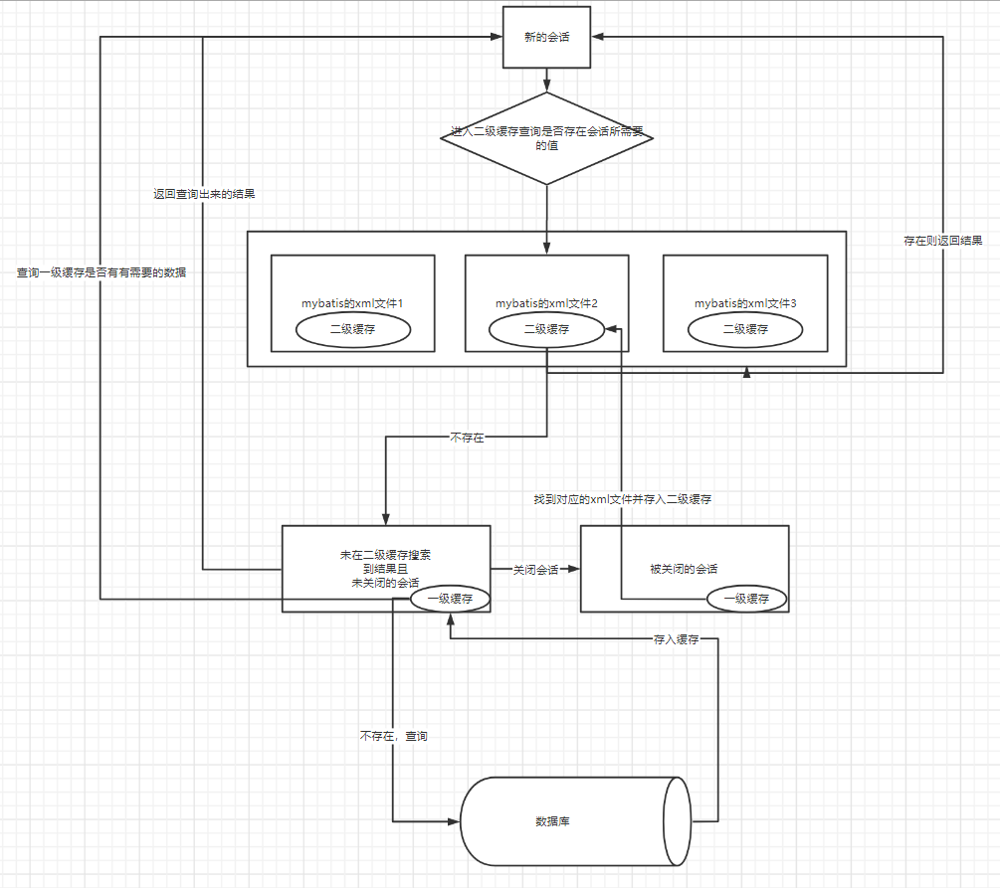


## 8.5.1 第三方缓存 --- ehcache

> 第三方纯Java的进程内缓存框架，具有快速、精干等特点
>
> 1. 快速
> 2. 简单
> 3. 多种缓存策略
> 4. 缓存数据会在虚拟机重启时写入磁盘
> 5. 可以通过RMI、可插入API等方式进行分布式缓存
> 6. 缓存数据有两级：内存和磁盘，因此无需担心容量问题
> 7. 具有缓存和缓存管理器的侦听接口
> 8. 支持多[缓存](https://baike.baidu.com/item/缓存)管理器实例，以及一个实例的多个缓存区域
> 9.  提供Hibernate的缓存实现

### 8.5.1-1 具体实现

> #### 到ehcache官网下载jar包或通过配置文件导入

```xml
<dependency>
    <groupId>org.mybatis.caches</groupId>
    <artifactId>mybatis-ehcache</artifactId>
    <version>1.1.0</version>
</dependency>
```

> #### 编写ehcache的配置文件

```xml
<?xml version="1.0" encoding="UTF-8" ?>
<ehcache xmlns:xsi = "http://www.w3.org/2001/XMLSchema-instance"
         xsi:noNamespaceSchemLocation="../config/ehcache.xsd">
    // 保存路径
    <diskStore path="F:\file\ehcache"/>
    <defaultCache
        maxElementsInMemory = "1"
        maxElementsOnDisk = "10000000"
        eternal = "false"
        overflowToDisk = "true"
        timeToIdleSeconds = "120"
        timeToLiveSeconds = "120"
        diskExpiryThreadIntervalSeconds = "120"
        memoryStoreEvictionPolicy = "LRU">
    </defaultCache>
</ehcache>
```

> #### 在mybatis文件中引入

```
<cache type="org.mybatis.caches.ehcache.EhcacheCache">

在其他mybatis文件也使用时使用，引入缓存
// namespace 指定和那个名称空间下的缓存一致
<cache-ref namespace = "org.mybatis.caches.ehcache.EhcacheCache"></cache-ref>
```


# 9.Mybatis 逆向工程 --- Generator

> 简称MBG,是一个专门为MyBatis框架使用者定制的代码生成器,可以快速的根据表生成对应的映射文件,接口,以及bean类。支持基本的增删查改,以及QBC风格的条件查询。但是表链接,存储过程等这些复杂sql的定义需要我们自行编写

## 9.1 Generator的创建及使用

### 9.1.1编写generatorConfig配置文件

```xml
<?xml version="1.0" encoding="UTF-8"?>
<!DOCTYPE generatorConfiguration
                PUBLIC "-//mybatis.org//DTD MyBatis Generator Configuration 1.0//EN"
                "http://mybatis.org/dtd/mybatis-generator-config_1_0.dtd">

<generatorConfiguration>
    <!--
                具体见 http://mybatis.org/generator
     -->
	<!--
		targetRuntime  选择模式
		MyBatis3Simple 生成简单版的CRUD
		MyBatis3       豪华版
	-->
    <context id="MySql" defaultModelType="flat" targetRuntime="MyBatis3Simple">

        <plugin type="org.mybatis.generator.plugins.SerializablePlugin"></plugin>

        <!--
                    jdbcConnection: 指定如何连接到目标数据库
                -->
        <jdbcConnection driverClass="com.mysql.cj.jdbc.Driver"
                        connectionURL="jdbc:mysql://localhost:3306/mybatis?serverTimezone=UTC"
                        userId="root"
                        password="123456">
        </jdbcConnection>

        <javaTypeResolver >
            <property name="forceBigDecimals" value="false" />
        </javaTypeResolver>

        <!--
                    javaModelGenerator 指定JavaBean的生成策略
                    targetPackage      目标包名
                    targetProject      目标工程
                -->
        <javaModelGenerator targetPackage="entity" targetProject="src/main/java/com/example/generator">
            <property name="enableSubPackages" value="true" />
            <property name="trimStrings" value="true" />
        </javaModelGenerator>

        <!--
                    sqlMapGenerator    指定mapper接口所在的位置
                -->
        <sqlMapGenerator targetPackage="dao"
                         targetProject="src/main/resources">
            <property name="enableSubPackages" value="true" />
        </sqlMapGenerator>

        <javaClientGenerator type="XMLMAPPER" targetPackage="dao"
                             targetProject="src/main/java/com/example/generator">
            <property name="enableSubPackages" value="true" />
        </javaClientGenerator>

        <!--
                    指定要逆向分析那些表： 根据表创建JavaBean
                -->
        <table tableName="tbl_employee" domainObjectName="Employee"></table>
        <table tableName="tbl_dept" domainObjectName="Department"></table>

        <!--        <table schema="DB2ADMIN" tableName="ALLTYPES" domainObjectName="Customer" >-->
        <!--            <property name="useActualColumnNames" value="true"/>-->
        <!--            <generatedKey column="ID" sqlStatement="DB2" identity="true" />-->
        <!--            <columnOverride column="DATE_FIELD" property="startDate" />-->
        <!--            <ignoreColumn column="FRED" />-->
        <!--            <columnOverride column="LONG_VARCHAR_FIELD" jdbcType="VARCHAR" />-->
        <!--        </table>-->

    </context>
</generatorConfiguration>
```


### 9.1.2 导入依赖

```xml
<!-- 
	在dependencies中写入
-->
<dependency>
    <groupId>org.mybatis.generator</groupId>
    <artifactId>mybatis-generator-maven-plugin</artifactId>
    <version>1.3.5</version>
</dependency>
<dependency>
    <groupId>org.mybatis.generator</groupId>
    <artifactId>mybatis-generator-core</artifactId>
    <version>1.3.7</version>
    <scope>provided</scope>
</dependency>

<!-- 
	在plugins中写入
-->
<plugin>
    <groupId>org.mybatis.generator</groupId>
    <artifactId>mybatis-generator-maven-plugin</artifactId>
    <version>1.3.7</version>
    <configuration>
        <configurationFile>src/main/resources/generatorConfig.xml</configurationFile>
        <overwrite>true</overwrite>
    </configuration>
    <dependencies>
        <dependency>
            <groupId>mysql</groupId>
            <artifactId>mysql-connector-java</artifactId>
            <version>8.0.12</version>
        </dependency>
    </dependencies>
</plugin>
```

### 9.1.3 通过Mevan运行配置文件

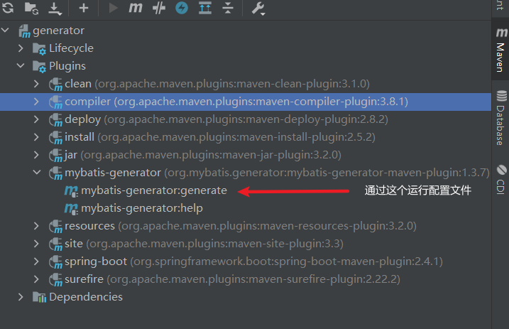


## 9.2 Generator  targetRuntime MyBatis3的使用

### 9.2.1 通过9.1生成targetRuntime 为MyBatis3的文件

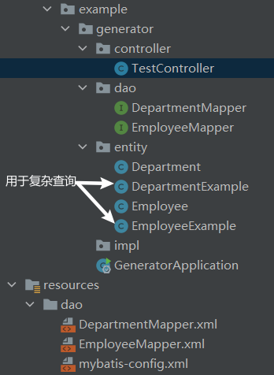

### 9.2.2 复杂查询的使用

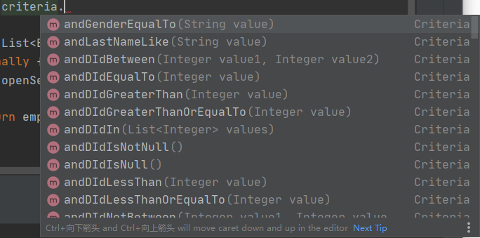

```Java
EmployeeExample employeeExample = new EmployeeExample();
// 创建Criteria, 用于拼接查询条件
Criteria criteria = employeeExample.createCriteria();
criteria.andLastNameLike("%c%");
criteria.andGenderEqualTo("1");

List<Employee> employeeList = mapper.selectByExample(employeeExample);
```


# 10 MyBatis 工作原理

> 流程
>
> 1. 获取sqlSessionFactory对象
>    - 解析文件的每一个信息保存在Configuration中，返回包含Configuration的DefaultSession
>    - 注: MappedStatement: 代表一个增删查改的详细信息
> 2. 获取SqlSession对象
>    - 返回一个DefaultSqlSession对象，包含Executor和Configuration，会创建一个Executor对象
> 3. 获取接口代理对象(MapperProxy)
>    - getMapper，使用MapperProxyFactory创建一个MapperProxy的代理对象
>    - 代理对象中包含了DefaultSqlSession(Execute)
> 4. 增删改流程图
>
> ### 总结
>
> 1. 根据配置文件(全局，sql映射)初始化Configuration对象
> 2. 创建DefaultSqlSession对象
>    - 里面包含Configuration以及Executor(根据全局配置文件中的defaultExecutorType创建对应的Executor)
> 3. DefaultSqlSession.getMapper():拿到Mapper接口对应的MapperProxy
> 4. MapperProxy里面有(DefalutSqlSession)
> 5. 执行增删查改方法
>    - 调用DefaultSqlSession的增删改查(Executor)
>    - 创建StatementHandler对象(同时创建ParameterHandler和ResultSetHandler)
>    - 调用StatementHandler的预编译参数和设置参数值,使用ParameterHandler为sql设置参数
>    - 调用StatementHandler的增删查改方法
>    - ResultSetHandler封装结果
> 6. 设置四大对象时每个创建时都有interceptorChain.pluginAll(parameterHandler)


### 10.1 sqlSessionFactory 源码流程图

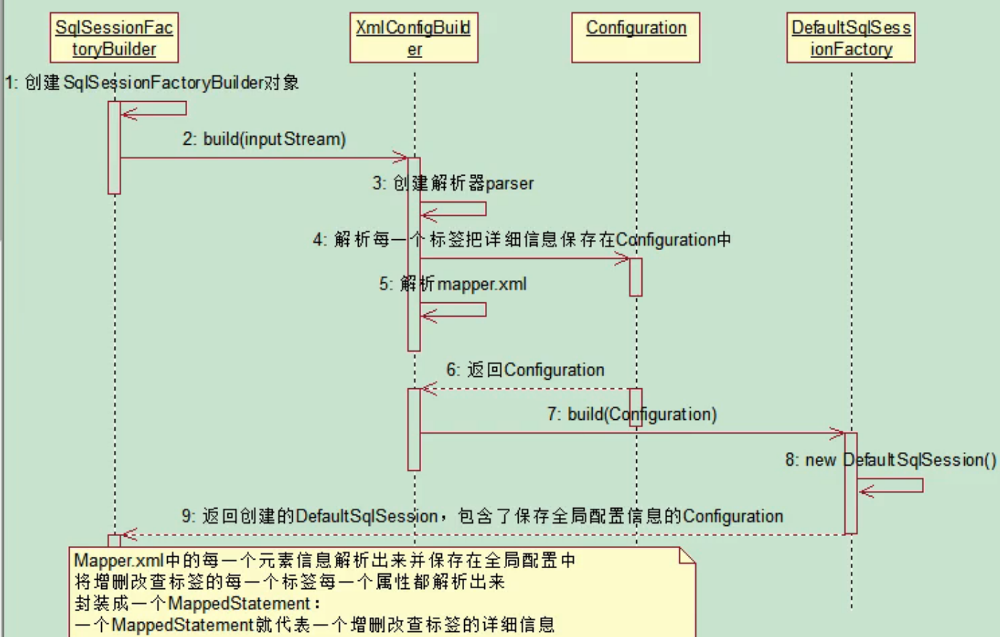

### 10.2 openSession

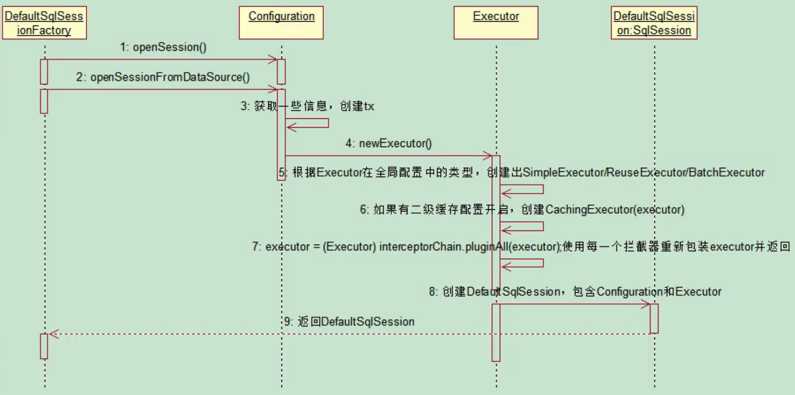

### 10.3 getMapper

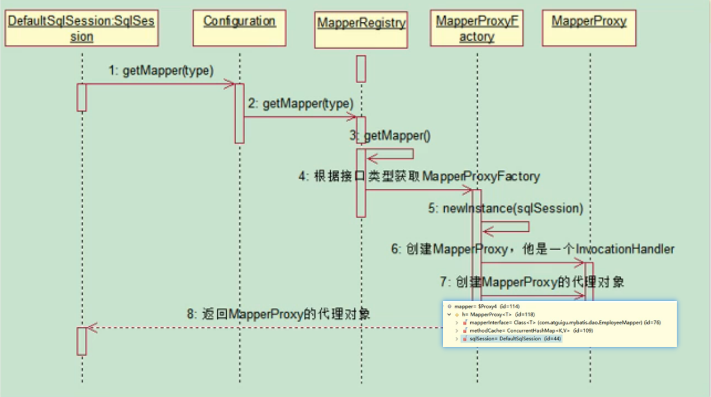

### 10.4 增删查流程图

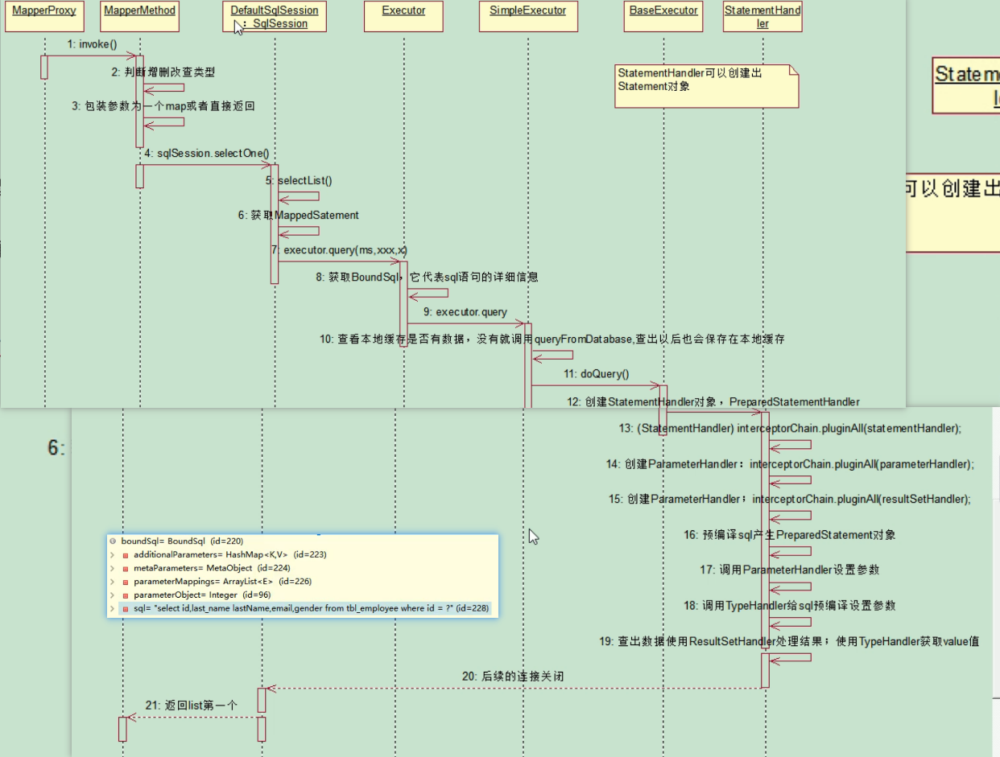

### 10.5 整体流程图

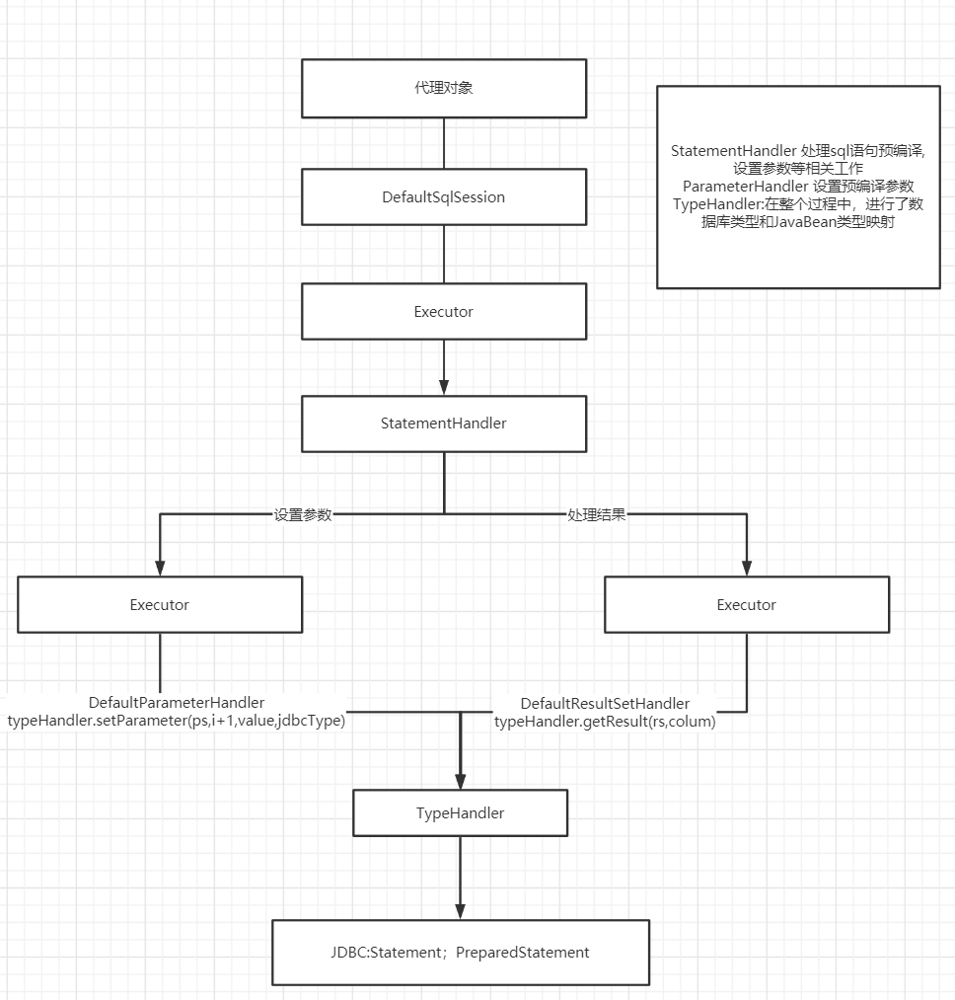

### 10.6 Mybatis 工作原理图

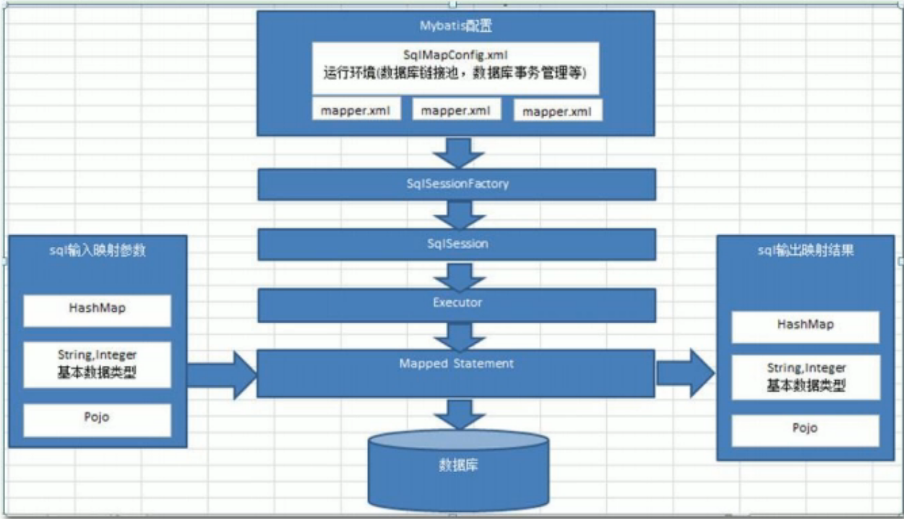


# 11 插件开发  (个人原因未深究)

> 于个人原因停留于https://www.bilibili.com/video/BV1Jb411J77t?p=82
>

### 11.1 插件原理

> 1. 每个创建出来的对象不是直接返回,而是interceptorChain.pluginAll(parameterHandler);
> 2. 获取到所有的Interceptor(拦截器)(插件需实现接口),调用interceptor.plugin(target);返回target包装后的对象
> 3. 插件机制，使用 插件为目标对象创建代理对象;AOP(面向切面),可以为四大对象创建代理对象,并拦截四大对象的执行方法


### 11.2 插件撰写

> #### 插件撰写
>
> 1. 编写Interceptor的实现类
> 2. 使用@Intercepts注解完成插件签名
> 3. 将写好的插件注册到全局配置文件中
>
> #### 注
>
> 1. 如果多个插件同时拦截同一个对象和方法时会产生多层代理
> 2. 出现多层代理时，代理对象的生成顺序由配置文件中的顺序决定，而代理对象执行方法时则是与代理对象的生成顺序相反
>
> #### 演示--Java类撰写
>
> ```Java
> package com.example.generator.dao;
> 
> import org.apache.ibatis.executor.statement.StatementHandler;
> import org.apache.ibatis.plugin.*;
> 
> import java.sql.Statement;
> import java.util.Properties;
> 
> /**
>  * @ClassName MyFirstPlugin
>  * @Description TODO
>  * @Author CGH
>  * @Date 2020/12/28 19:35
>  * @Version 1.0
>  */
> 
> /***
>  * 完成插件签名
>  *      告知MyBatis抽奖用于拦截那个对象的那个方法
>  */
> @Intercepts({
>         @Signature(type= StatementHandler.class,method = "parameterize",args = java.sql.Statement.class)
> })
> public class MyFirstPlugin implements Interceptor {
> 
>     /***
>      * intercept 拦截
>      *      拦截目标对象的目标方法执行
>      * @param invocation
>      * @return
>      * @throws Throwable
>      */
> 
>     @Override
>     public Object intercept(Invocation invocation) throws Throwable {
> 
>         System.out.println("MyFirstPlugin....intercept" + invocation.getMethod());
> 
>         Object proceed = invocation.proceed();
> 
>         return proceed;
>     }
> 
>     /***
>      * plugin 包装
>      *      保证目标对象,为目标对象创建代理对象
>      * @param target
>      * @return
>      */
> 
>     @Override
>     public Object plugin(Object target) {
> 
>         System.out.println("MyFirstPlugin......plugin" + target);
> 
>         // 借助Plugin的wrap方法来使用当前Interceptor包装我们的目标对象
>         Object wrap = Plugin.wrap(target, this);
>         // 返回当前target创建的动态代理
>         return wrap;
>     }
> 
> 
>     /***
>      *  setProperties 属性注册
>      *      将插件注册时的property属性设置进来
>      *      property 指配置文件中的plugins属性
>      * @param properties
>      */
> 
>     @Override
>     public void setProperties(Properties properties) {
>         System.out.println("注册信息" + properties);
>     }
> }
> 
> ```
>
> #### 演示--xml文件撰写
>
> ```xml
> <configuration>
>     <plugins>
>         <plugin interceptor="com.example.generator.dao.MyFirstPlugin">
>             <property name="username" value="root"/>
>             <property name="password" value="123456"/>
>         </plugin>
>     </plugins>
>     <environments>
>     	.......
>     </environments>
> </configuration>
> ```


# #. 补充系列

##  #.#.1 补充

### pox.xml > 识别指定路径下的指定后缀名文件

> ```java
> <resources>
>             <resource>
>                 <directory>src/main/resources</directory>
>                 <includes>
>                     <include>**/*.properties</include>
>                     <include>**/*.xml</include>
>                 </includes>
>                 <filtering>true</filtering>
>             </resource>
>             <resource>
>                 <directory>src/main/java</directory>
>                 <includes>
>                     <include>**/*.properties</include>
>                     <include>**/*.xml</include>
>                 </includes>
>                 <filtering>true</filtering>
>             </resource>
>  </resources>
> ```

### application.yml > 识别src/maib/XXX的所有xml文件(在有多个存放xml文件的文件夹时使用

> ```Java
>  mybatis:
>   mapper-locations: classpath:/resources/*.xml
>   type-aliases-package: src/main
> ```


## #.#.2 insert补充

> **mysql是支持自增主键的获取的利用的是statement.getGenreatedKeys()方法**
>
> - useGeneratedKeys = true 
>   - 使用自增主键值策略
> - keyProperty
>   - 指定对应主键属性，也就是获取主键值后，将其封装给JavaBean的指定属性
>
> **在oracle下**
>
> - order
>
>   - Before
>     - 在当前sql之前运行预设在selectKey的sql语句
>   - After
>     - 在当前sql之后运行预设在selectKey的sql语句
>
>   

> ### 写法 
>
> ```xml
> <insert id="addEmp" useGeneratedKeys="true" keyProperty="id">
>         insert into tbl_employee(last_name,email,gender)
>         value (#{lastName},#{email},#{gender})
> </insert>
> 
> 在Oracle的Before下
> <insert id="addEmp" order="BEFORE" keyProperty="id">
>     <selectKey>
>     	select 表名.nextval from dual
>         //获取主键自增的值
>     </selectKey>
>     
>         insert into tbl_employee(last_name,email,gender)
>         value (#{lastName},#{email},#{gender})
> </insert>
> 在Oracle的After下
> <insert id="addEmp" order="BEFORE" keyProperty="id">
>     <selectKey>
>     	select 表名.currval from dual
>         //获取主键自增的值
>     </selectKey>
>         insert into tbl_employee(last_name,email,gender)
>         value (表名.nextval,#{lastName},#{email},#{gender})
> </insert>
> 
> 
> 1. currval 获取当前的值
> 2. nextval 获取当前的下一个值
> ```

## #.#.3 参数处理补充

> **在新版中已经取消了#{0}这类用法**

### #.#.3-1其他情况取值

```java
public Employee getEmpById(@Param("id")Integer id,@Param("e")Employee emp);
取值： id ==> #{param1}/#{id}    last_name ==>#{param2.lastName}/#{e.lastName}
```


## #.#.4 分步查询补充

### #.#.4-1 懒加载

> - 可以延迟加载，当数据需要使用时再加载
> - 需要在全局配置文件添加两个配置

```xml
<settings>
    <!--任何需要更改配置的值，即使他的默认与我们显示写的相同，也要显示的写，以免版本更替带来的麻烦-->
    <setting name="lazyLoadinEnabled" value="true"/>
    <setting name="aggressiveLazyLoading" value="false"/>
</settings>
```


## #.#.5 OGNL表达式

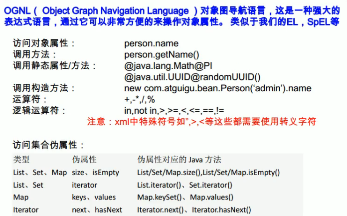

## #.#.6 带有实体名称的ASCII实体

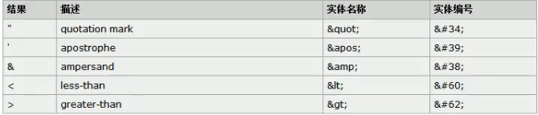